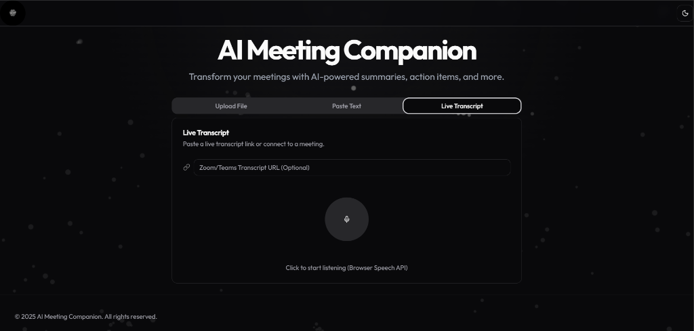

# AI Meeting Companion

Transform your meetings with AI-powered summaries, action items, and more.


## 🚀 Features

AI Meeting Companion is a powerful tool designed to streamline your post-meeting workflow. It leverages advanced AI to process meeting data and extract valuable insights.

### 1. Flexible Input Methods
*   **Upload File**: Drag and drop audio files (mp3, m4a) or transcript documents (txt, docx, pdf).
*   **Paste Text**: Directly paste your meeting notes or raw transcripts for instant processing.
*   **Live Transcript**: Connect to live meeting feeds (Zoom/Teams) for real-time analysis.

### 2. AI-Powered Analysis
*   **Smart Summaries**: Get concise summaries of long discussions.
*   **Action Items**: Automatically extract tasks and assignees.
*   **Key Topics**: Identify the main themes discussed.

### 3. Modern & Immersive UI
*   **Next-Gen Aesthetic**: Glassmorphism design with a premium feel.
*   **Interactive Background**: Dynamic particle animation that reacts to your cursor.
*   **Dark/Light Mode**: Seamlessly switch between themes to match your preference.

## 📸 Screenshots

### Upload Meeting Data
Easily upload your meeting files.


### Paste Transcript
Quickly paste text for analysis.


### Live Transcript
Connect to live meetings.


## 🛠️ Tech Stack

*   **Frontend**: React, TypeScript, Vite, Tailwind CSS, Framer Motion
*   **Backend**: Node.js, Express
*   **Styling**: Shadcn UI, Lucide React, Google Fonts (Outfit)
*   **Animation**: HTML5 Canvas (Interactive Background)

## 🏁 Getting Started

Follow these steps to set up the project locally.

### Prerequisites
*   Node.js (v16 or higher)
*   npm or yarn

### Installation

1.  **Clone the repository**
    ```bash
    git clone <repository-url>
    cd ai-meeting-companion
    ```

2.  **Install Server Dependencies**
    ```bash
    cd server
    npm install
    ```

3.  **Install Client Dependencies**
    ```bash
    cd ../client
    npm install
    ```

### Running the Application

1.  **Start the Server**
    ```bash
    # In the server directory
    npm start
    ```

2.  **Start the Client**
    ```bash
    # In the client directory
    npm run dev
    ```

3.  Open your browser and navigate to `http://localhost:5173`.

## 📄 License

© 2025 AI Meeting Companion. All rights reserved.
