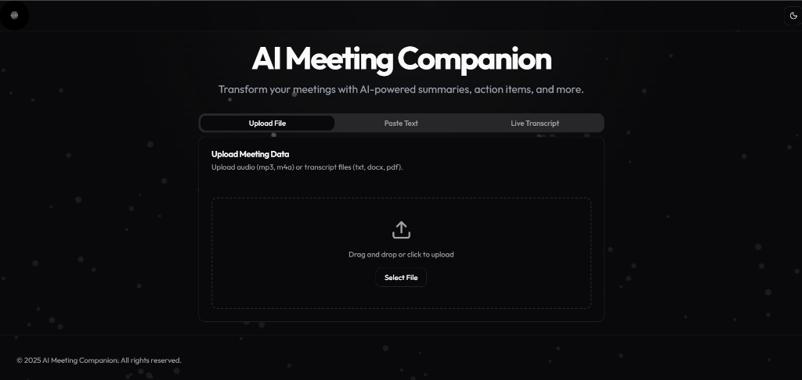

# AI Meeting Companion

Transform your meetings with AI-powered summaries, action items, and more.



## Features

AI Meeting Companion is a comprehensive tool designed to revolutionize how you interact with meeting data. By leveraging advanced Artificial Intelligence, it transforms raw audio and text into actionable insights, saving you time and ensuring no critical detail is missed.

### 1. Versatile Input Methods

The application supports multiple ways to input meeting data, catering to different workflows and scenarios:

*   **File Upload**: Seamlessly upload existing meeting records. The system supports a wide range of formats including audio files (MP3, M4A) for automatic transcription and document files (TXT, DOCX, PDF) for direct analysis.
*   **Paste Text**: For quick processing of existing notes or clipboard content, simply paste your text directly into the application. This is ideal for processing email threads or manual meeting minutes.
*   **Live Audio Recording**: Capture meetings in real-time using the built-in microphone integration. Powered by the Web Speech API, this feature provides instant transcription as you speak, allowing you to focus on the conversation while the app captures the details.

### 2. Intelligent AI Analysis

Once data is ingested, our powerful AI engine breaks it down to provide deep understanding and clarity:

*   **Smart Summarization**: Condenses long discussions into concise, readable summaries. It identifies the core narrative of the meeting, allowing you to grasp the essence of hour-long calls in minutes.
*   **Action Item Extraction**: Automatically identifies tasks, assignments, and deadlines mentioned during the meeting. It creates a structured list of "Who needs to do What," ensuring accountability and follow-through.
*   **Key Decision Tracking**: Highlights critical decisions made during the session. This feature separates agreed-upon outcomes from general discussion, providing a clear record of consensus.
*   **Sentiment & Tone Analysis**: Analyzes the emotional undertone of the meeting. It can detect whether the conversation was positive, neutral, or concerned, giving you insights into team morale and client satisfaction.

### 3. Modern & Immersive User Experience

The application is built with a focus on aesthetics and usability, ensuring a premium experience:

*   **Interactive Particle Background**: A dynamic, cursor-reactive background adds a layer of visual depth and engagement without distracting from the content.
*   **Adaptive Theme System**: Fully supports both Dark and Light modes. The interface automatically adjusts colors, contrast, and visual elements to provide optimal readability in any lighting condition.
*   **Responsive Design**: Whether you are on a large desktop monitor or a laptop, the layout adapts fluidly to ensure all information is accessible and well-organized.

## Tech Stack

This project is built using a robust modern technology stack to ensure performance, scalability, and maintainability:

*   **Frontend Framework**: React with TypeScript for type-safe, component-based UI development.
*   **Build Tool**: Vite for lightning-fast development server start-up and optimized production builds.
*   **Styling**: Tailwind CSS for utility-first styling, combined with Shadcn UI for accessible, pre-built components.
*   **State Management**: Redux Toolkit for efficient global state management across the application.
*   **Backend Runtime**: Node.js environment.
*   **API Server**: Express.js for handling API requests and file processing.
*   **AI Integration**: Integration with advanced LLMs (Large Language Models) for text processing and analysis.

## Getting Started

Follow these instructions to set up the project on your local machine for development and testing purposes.

### Prerequisites

Ensure you have the following installed on your system:
*   Node.js (v16 or higher)
*   npm (Node Package Manager)

### Installation Guide

1.  **Clone the Repository**
    ```bash
    git clone <repository-url>
    cd ai-meeting-companion
    ```

2.  **Install Server Dependencies**
    Navigate to the server directory and install the necessary packages:
    ```bash
    cd server
    npm install
    ```

3.  **Install Client Dependencies**
    Navigate to the client directory and install the frontend packages:
    ```bash
    cd ../client
    npm install
    ```

### Running the Application

To run the full application, you will need to start both the backend server and the frontend client.

1.  **Start the Backend Server**
    In the `server` directory, run:
    ```bash
    npm start
    ```
    The server will start, typically on port 3000.

2.  **Start the Frontend Client**
    In the `client` directory, run:
    ```bash
    npm run dev
    ```
    The client development server will start.

3.  **Access the Application**
    Open your web browser and navigate to the URL provided by Vite (usually `http://localhost:5173`).

## License

© 2025 AI Meeting Companion. All rights reserved.
